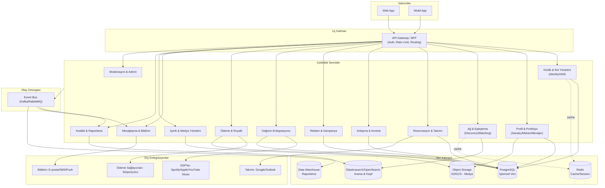

# Müzik Ekosistemi Platformu — Sistem Mimarisi ve Modül Planlaması

## 1. Vizyon

Menajerler, reklamcılar, bağımsız sanatçılar, dijital distribütörler ve mekan sahipleri gibi
müzik endüstrisindeki tüm paydaşları **tek bir işbirliği ağında** buluşturan, uçtan uca bir
platform. Amaç; sanatçı keşfinden dijital dağıtıma, canlı performans rezervasyonundan reklam/
sponsorluk anlaşmalarına kadar tüm iş akışlarını tek bir merkezden yönetilebilir hale getirmek.

## 2. Paydaşlar (Aktörler) ve Temel İhtiyaçları

| Rol | Platformdan Temel Beklenti |
|---|---|
| Bağımsız Sanatçı | Portfolyo/EPK oluşturma, mekan/menajer bulma, dağıtım, gelir takibi |
| Menajer | Sanatçı portföyü yönetimi, anlaşma/kontrat takibi, takvim & rezervasyon |
| Reklamcı / Marka | Sanatçı/mekan keşfi, kampanya oluşturma, sponsorluk teklifleri, performans raporu |
| Dijital Distribütör | Müzik yükleme/dağıtım API entegrasyonu, telif & royalti raporlama |
| Mekan Sahibi | Etkinlik takvimi, sanatçı rezervasyonu, bilet/kapasite yönetimi, ödeme |
| Platform Yöneticisi (Admin) | Moderasyon, uyuşmazlık çözümü, komisyon/finans yönetimi |

## 3. Mimari Yaklaşım

Çok kiracılı (multi-tenant), rol bazlı erişimin merkezde olduğu bir **modüler
monolit → mikroservis geçişine uygun** mimari öneriliyor: MVP aşamasında modüler monolit
(hızlı geliştirme, düşük operasyonel yük), ölçek arttıkça sınırları net olan modüller ayrı
servislere kolayca çıkarılabilir (özellikle Dağıtım, Ödeme/Royalti ve Bildirim modülleri ilk
ayrılacak adaylardır).



## 4. Temel Modüller

### 4.1 Kimlik & Rol Yönetimi (Identity/IAM)
- Çoklu rol desteği (bir kullanıcı hem sanatçı hem menajer olabilir), organizasyon/ekip yapısı.
- OAuth2/OIDC tabanlı kimlik doğrulama, SSO desteği, ince taneli yetkilendirme (RBAC + kaynak
  bazlı izinler — örn. bir menajer yalnızca yönettiği sanatçıların anlaşmalarını görebilir).
- KYC/doğrulama akışı (özellikle ödeme ve kontrat modülleri için gerekli kimlik doğrulaması).

### 4.2 Profil & Portfolyo
- Sanatçı: EPK (Electronic Press Kit), müzik örnekleri, tür/etiket, sosyal medya bağlantıları,
  performans geçmişi.
- Mekan: kapasite, teknik altyapı (backline/ses sistemi), lokasyon, müsaitlik takvimi.
- Menajer/Reklamcı: yönettiği/temsil ettiği portföy, geçmiş kampanya/anlaşma referansları.
- Doğrulanmış rozet sistemi (verified profile) — güven ve dolandırıcılık önleme için.

### 4.3 Ağ & Eşleştirme (Discovery / Matching)
- Tür, lokasyon, bütçe, müsaitlik gibi kriterlere göre arama ve öneri motoru.
- "Sanatçı ↔ Mekan", "Sanatçı ↔ Reklamcı", "Sanatçı ↔ Menajer" eşleştirme algoritmaları.
- Elasticsearch/OpenSearch tabanlı facet arama; ileride embedding tabanlı benzerlik önerisi.

### 4.4 Rezervasyon & Takvim
- Mekan müsaitlik takvimi, teklif/onay iş akışı (booking request → negotiation → confirmation).
- Çakışma kontrolü, harici takvim senkronizasyonu (Google/Outlook), otomatik hatırlatmalar.

### 4.5 Anlaşma & Kontrat Yönetimi
- Şablon tabanlı dijital kontrat oluşturma (performans anlaşması, sponsorluk anlaşması, dağıtım
  anlaşması), e-imza entegrasyonu (DocuSign/HelloSign benzeri).
- Versiyonlama, onay zinciri, anlaşma durum makinesi (draft → negotiation → signed → completed).

### 4.6 Reklam & Kampanya (Advertiser Modülü)
- Kampanya oluşturma, hedef kitle/tür/mekan bazlı sponsorluk fırsatları, teklif yönetimi.
- Kampanya performans takibi (gösterim, etkileşim, dönüşüm) — Analitik modülüyle entegre.

### 4.7 Dağıtım Entegrasyonu (Digital Distribution)
- Dış DSP'lerle (Spotify, Apple Music, YouTube Music, DistroKid-tipi distribütörler) API
  entegrasyonu; adapter/plugin mimarisi ile yeni distribütör eklemek kolay olmalı.
- Müzik yükleme, metadata (ISRC/UPC) yönetimi, yayın durumu takibi.
- Bu modül, farklı ve sık değişen dış API'lere bağımlı olduğu için **erken mikroservise
  ayrılacak** ilk adaydır (bağımsız deploy, hata izolasyonu).

### 4.8 Ödeme & Royalti
- Çoklu para birimi, komisyon/işlem ücreti hesaplama, otomatik gelir paylaşımı (split
  payments — sanatçı/menajer/platform payı).
- Royalti raporlama (distribütörlerden gelen stream/satış verisinin normalize edilmesi).
- Ödeme sağlayıcı entegrasyonu (Stripe Connect / Iyzico gibi pazaryeri ödeme modelleri),
  PCI-DSS kapsamı dışına çıkmak için kart verisi asla kendi sistemimizde tutulmaz (tokenization).

### 4.9 Mesajlaşma & Bildirim
- Gerçek zamanlı mesajlaşma (WebSocket), teklif/anlaşma bildirimleri, e-posta/SMS/push
  entegrasyonu, bildirim tercihleri yönetimi.

### 4.10 İçerik & Medya Yönetimi
- Ses/görsel dosya yükleme, transcoding (streaming için), CDN dağıtımı, telif hakkı/lisans
  bilgisi etiketleme.

### 4.11 Analitik & Raporlama
- Sanatçı/kampanya/mekan bazlı performans panoları, gelir raporları, olay tabanlı (event-driven)
  veri toplama → veri ambarına akış (ETL/CDC).

### 4.12 Moderasyon & Admin
- İçerik/kullanıcı moderasyonu, uyuşmazlık çözüm akışı, komisyon/ücret yapılandırması,
  denetim kaydı (audit log).

## 5. Çekirdek Veri Modeli (Özet Varlıklar)

```
User ──< Role (artist | manager | advertiser | distributor | venue_owner | admin)
Organization ──< Member (User + Role)
ArtistProfile ── User
VenueProfile ── Organization
Track/Release ── ArtistProfile
Booking (venue, artist, date, status)
Deal/Contract (parties[], type, terms, status, signed_documents)
Campaign (advertiser, target_criteria, budget, status)
Payment/Transaction (payer, payee, amount, type, related_entity)
DistributionSubmission (release, dsp_target, status, external_ids)
Message/Thread (participants[], related_entity)
Notification (user, channel, payload, status)
```

## 6. Önerilen Teknoloji Yığını

| Katman | Öneri |
|---|---|
| Backend | Node.js (NestJS) veya Go — modüler servisler için; NestJS modül yapısı bu domain'e çok uygun |
| Frontend | React/Next.js (Web), React Native veya Flutter (Mobil) |
| API | REST + dahili servisler arası gRPC; dış entegrasyon için webhook desteği |
| Veritabanı | PostgreSQL (çekirdek), Redis (cache/oturum), Elasticsearch/OpenSearch (arama) |
| Mesajlaşma/Event | Kafka veya RabbitMQ (olay tabanlı entegrasyon, analytics pipeline) |
| Depolama | S3 uyumlu object storage + CDN (CloudFront/Cloudflare) |
| Kimlik | OAuth2/OIDC (Auth0/Keycloak veya kendi IAM servisimiz) |
| Altyapı | Kubernetes, Terraform (IaC), CI/CD (GitHub Actions) |
| Gözlemlenebilirlik | OpenTelemetry, Prometheus/Grafana, merkezi loglama (ELK) |

## 7. Güvenlik ve Uyumluluk

- KVKK/GDPR uyumu (kullanıcı verisi, silme/taşıma hakkı).
- Sözleşme ve ödeme verileri için şifreleme (at-rest & in-transit), rol bazlı erişim denetimi.
- Kart verisi tutulmaz — ödeme sağlayıcı tokenization'ı kullanılır (PCI-DSS kapsamını daraltır).
- Telif hakkı/lisans doğrulama akışı, dağıtım öncesi içerik kontrolü.

## 8. Ölçeklenebilirlik ve Mimari Evrim

1. **Faz 0 — MVP (Modüler Monolit):** Kimlik, Profil, Ağ & Eşleştirme, Rezervasyon, temel
   Mesajlaşma. Tek dağıtılabilir backend, net modül sınırları (NestJS module/DDD katmanları).
2. **Faz 1 — Genişleme:** Anlaşma/Kontrat, Ödeme & Royalti, Bildirim modülleri eklenir; Event
   Bus devreye girer (modüller arası senkron çağrı yerine olay tabanlı iletişime geçiş başlar).
3. **Faz 2 — Mikroservis Ayrıştırma:** Dağıtım Entegrasyonu ve Ödeme & Royalti bağımsız
   servislere çıkarılır (dış API bağımlılığı yüksek, farklı ölçekleme ihtiyaçları var).
4. **Faz 3 — Reklam & Analitik Ölçekleme:** Kampanya modülü ve veri ambarı/analitik hattı
   büyük veri hacmine göre ayrı ölçeklenir (stream processing eklenebilir).

## 9. Önerilen Depo (Monorepo) Dizin Yapısı

```
/apps
  /web                # Next.js web istemcisi
  /mobile              # React Native / Flutter istemcisi
  /gateway             # API Gateway / BFF
/services
  /identity
  /profile
  /discovery
  /booking
  /deals
  /advertising
  /distribution
  /payments
  /messaging
  /media
  /analytics
  /admin
/packages
  /shared-types        # Ortak DTO/tip tanımları
  /event-contracts      # Event bus mesaj şemaları
  /ui-kit               # Ortak tasarım sistemi bileşenleri
/infra
  /terraform
  /k8s
  /ci
```

## 10. Sonraki Adımlar

1. Domain modelinin (varlıklar, durum makineleri) detaylı tasarımı ve veritabanı şema taslağı.
2. Kimlik & Rol Yönetimi modülünün MVP olarak geliştirilmesi (tüm diğer modüllerin bağımlı
   olduğu temel katman).
3. Profil + Ağ & Eşleştirme modülleriyle çekirdek kullanıcı akışının uçtan uca prototiplenmesi.
4. İlk dış entegrasyon adaylarının (bir DSP, bir ödeme sağlayıcısı) seçilip pilot entegrasyonun
   yapılması.
